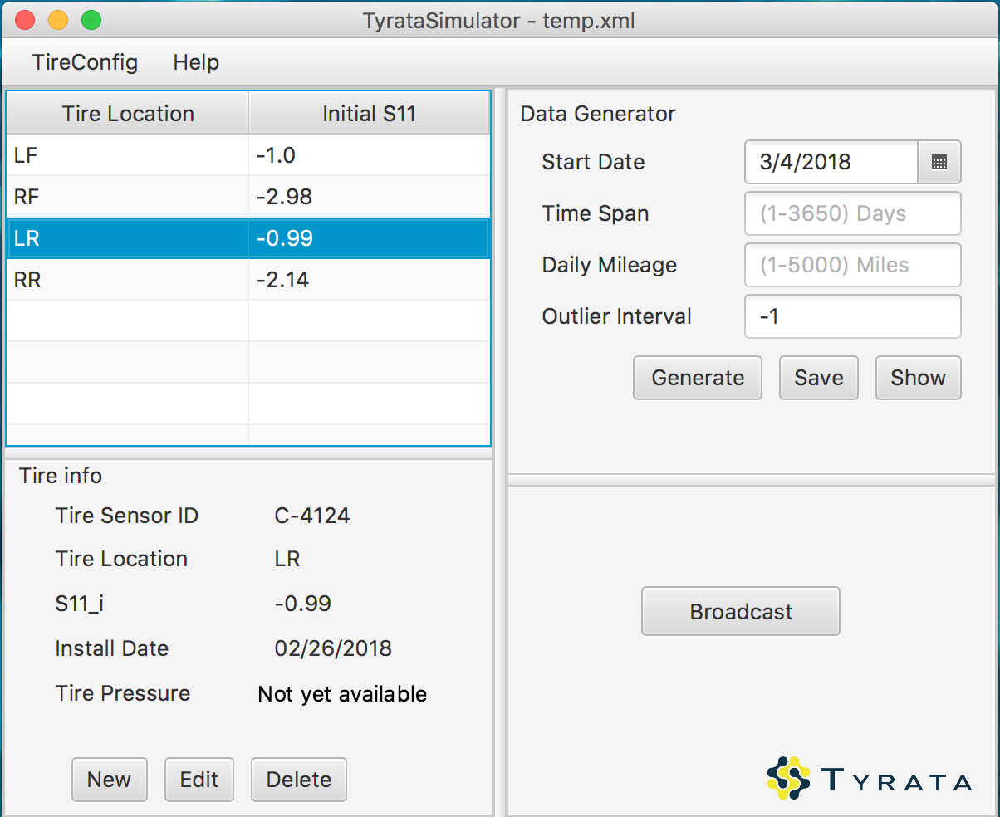

## TyrataSimulator 1.0.0

The project now implements following functionality on the client application. 

**Configure Tire Info**, including tireID, Position, S11_i, installationDate(for record)

**Export/Import Tire Configuration** as .xml files.

**Generate Data**, with specified startDate, timeSpan, dailyMileage, outlierInterval

**Display Data** on screen.

Note: unresolved issues logged in [issuenote.md](./issuenote.md)

