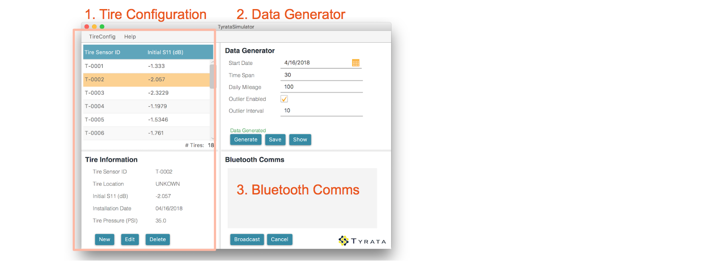
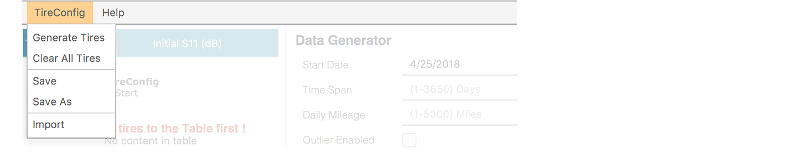
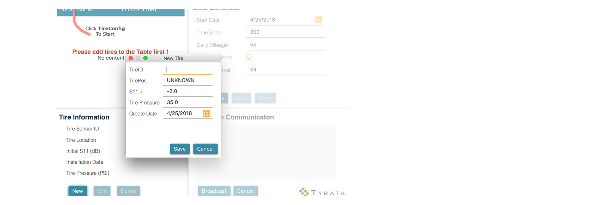
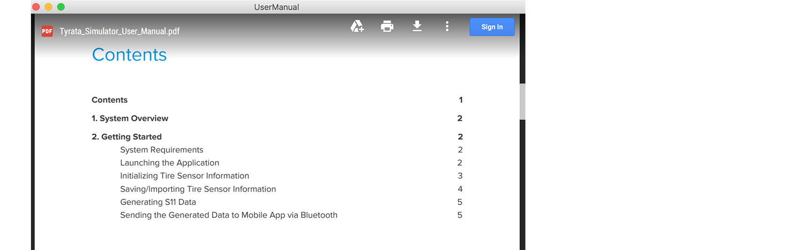

#### Track our progress on Trello: https://trello.com/tyrataclient

# TyrataSimulator 1.2.0

TyrataSimulator is a pc program that generates simulated Tyrata sensors output and transmits the data through Bluetooth.


## Getting Started

\* Details in [User Manual](./doc/Tyrata_Simulator_User_Manual.pdf)

1. Clone the project to Eclipse 
    `File` => `Import`, select `Git` => `Projects from Git`
2. Build the project and Run 


**Environment Requirement**

- Java SE 8 [1.8.0_162]
- Windows 10 (for Bluetooth to run)
- [JavaFX 8](http://www.oracle.com/technetwork/java/javase/overview/javafx-overview-2158620.html) - GUI library for JAVA
- BlueCove 2.1.2


## File structure

```
 /
 |- src			  -> The main source folder containing all Java files 
 |- build		  -> resources for build
 |- doc 		  -> resources used for readme(this file)
 |- lib			  -> 3rd party libraries needed for compilation and run. 
 |- resources      -> A source folder containing required resource files. 
	|- img         -> Image files for the app
 |- build.fxbuild  -> JavaFx build support file
 |- README.md      -> this file
```

## Sprints

\* Details in [Sprint Log](./doc/sprint_log.md)

#### Sprint1 (2.19 ~ 3.4)

1. Evaluated requirements for tyrata simulator, did architecture design
2. Deployed development Environment
3. Developed data generator model 
4. Built a functioning User Interface with control

#### Sprint2 (3.5 ~ 3.25)

1. Re-designed User Interface
2. Implemented XML File Storage
3. Established bluetooth connection & transmission

#### Sprint3 (3.26 ~ 4.8)

1. Integrated bluetooth package into application
2. Modified Data Generating Algorithm (random outlier interval)
3. Improved User Interface Control (disable buttons for clarity, add help document link, etc.)
4. Performed code refactoring

## Functions



### Part 1 TireSensor Configuration and View

#### Tire Table

In *menu bar* - *TireConfig*



`Generate Tires` - Generate tires with customized number of tires

> Sensor ID Format : T-0001 (4 digit number starts from 0001)

> Init S11 Range: Between [-2.5, -1], with precision of 4 decimal places

> Tire Location: Set to UNKNOWN

`Clear All Tires` - Clear all tires in the list

`Save` - Save the file to opened file path (path shown on the title)

`Save As` - Save the configuration as a new .xml file

`Import` - Import tire configuration from file system

#### Tire

*In the TableView on the left of Main Interface*



Each tire comes with <u>sensor ID</u>, <u>Location indicator</u>, <u>initial S11</u>, <u>install date</u>, and <u>tire pressure</u>. Only initial S11 is used for computation, install date and tire pressure are listed for reference.

###### Mouse/Keyboard Control 

Click on a tire to see details, double-click to edit.

Press *Delete* or *BackSpace* on keyboard to delete. Hit *Enter* on keyboard to confirm.

###### Components

`New` - Define a new tire

`Edit` - Edit parameters of a tire

`Delete` - Delete selected tire

### Part 2 Data Generator 

*In the Panel on top-right of Main Interface*

**Code** package *dg.model*

4 parameters are required to generate simulation data: *start date*, *time span*, *daily mileage*, and *outlier interval* (optional).

###### Components

`Generate` - Generate Data

`Save` - Save the data as .xml file

`Show` - Show the data in a new window

### Part 3 Data Broadcasting via Bluetooth

*In the Panel on bottom-right of Main Interface*

**Code** package `dg.bluetooth `

###### **Components**

textFlow - displaying feedback

`Broadcast` - Start broadcasting

`Cancel` - Cancel broadcasting

### Part 4 Help

In *menu bar* - *Help*

`HelpDoc` - A Hyperlink to User Manual



`About` - Copyright info

Copyright info

```
Version: 1.2.0 
Author: ECE651 Tyrata Client Team
(c) Copyright TyrataSimulator contributors and others 2018.  All rights reserved. Tyrata logo is trademark of the Tyrata Inc., https://www.tyrata.com/.
```

## Built with

- Java SE 8 [1.8.0_162]
- [JavaFX 8](http://www.oracle.com/technetwork/java/javase/overview/javafx-overview-2158620.html) - GUI library for JAVA
- [Scene Builder 2.0](http://www.oracle.com/technetwork/java/javase/downloads/javafxscenebuilder-1x-archive-2199384.html) A Visual Layout Tool for JavaFX Applications

## Authors

Zike Qin

Yinsi Zhang

Zhizhou Zhang

Yifan Li

Haohong Zhao