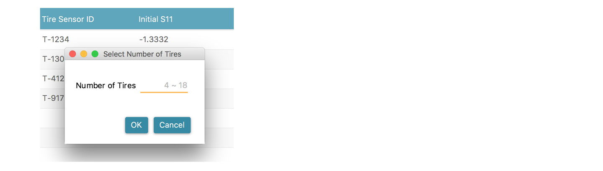
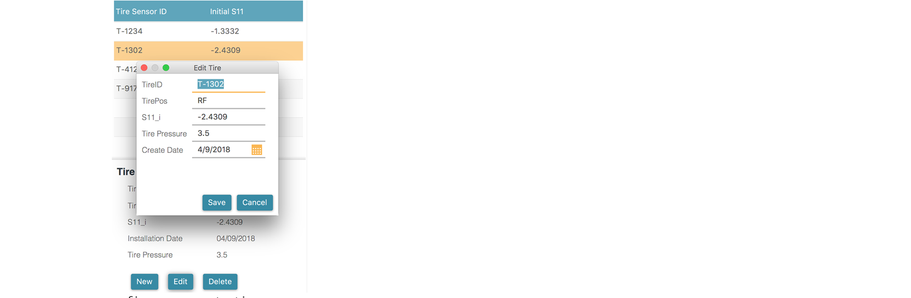
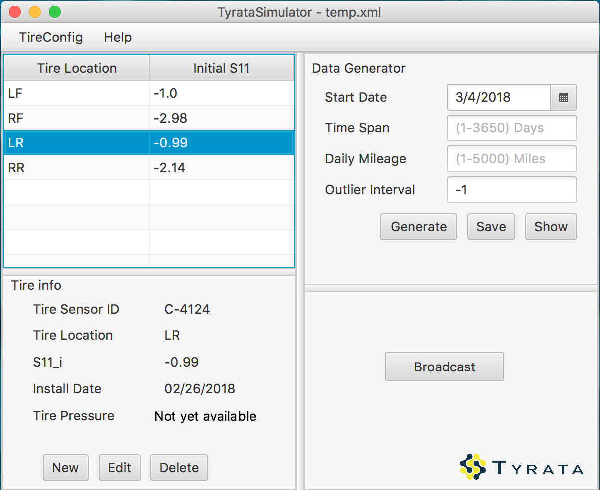

#### Track our progress on Trello: https://trello.com/tyrataclient

# Sprint 2 TyrataSimulator 1.1.0

TyrataSimulator is a pc program that generates simulated Tyrata sensors output and transmits the data through Bluetooth.

## Getting Started

1. Clone the project to Eclipse 
    `File` => `Import`, select `Git` => `Projects from Git`
2. Build the project and Run 

**Environment Requirement**

- Java SE 8 [1.8.0_162]
- Windows 10 (for Bluetooth to run)
- [JavaFX 8](http://www.oracle.com/technetwork/java/javase/overview/javafx-overview-2158620.html) - GUI library for JAVA

## Tire Configuration

Upon launching, the program gives 4 default tires listed in a table.

**Key Board Control**

DELETE / BACKSPACE - Delete selected tire

#### Tire Configuration on Menu Bar

If you wish to import or save the configuration, go to `menu bar` - `TireConfig` 

`Generate Tires` - Generate tires with customized number of tires

> Sensor ID Format : `T-0000` Randomly generated 4 digit number

> Init S11 Range: Between [-2.5, -1], with precision of 4 decimal places

> Tire Location: Set to UNKOWN

`Clear All Tires` - Clear all tires in the list

`Save` - Save the file to opened file path (path shown on the title)

`Save As` - Save the configuration as a new .xml file

`Import` - Import tire configuration from file system

#### Edit Tires

Each tire comes with sensor ID, Location indicator, initial S11, install date, and tire pressure. 
Only initial S11 is used for computation, install date and tire pressure are listed for reference.

In the table, three actions are allowed: 

`Click` on a tire to see details, `double-click` to edit, and press `Delete` or `BackSpace` on keyboard to delete.

You can also do this using buttons on bottom-left screen:

`New` - Define a new tire

`Edit` - Edit parameters of a tire

`Delete` - Delete selected tire

**Key Board Control**

ENTER - Confirm

## Data Generator 

4 parameters are required to generate simulation data: start date, time span, daily mileage, and ourlier interval (optional).

`Generate` - Generate Data

`Save` - Save the data as .xml file

`Show` - Show the data in UI

## Data Broadcast via Bluetooth

We successfully implemented Bluetooth connection seperately, and tested with Android app. 
Code can be found in dg.bluetooth package. UI interface for connection is also implemented. 
Integration into the main app will be completed in sprint 3. 

`Broadcast` - Start broadcasting (feedback info in the textFlow)

`Cancel` - Stop broadcasting (feedback info in the textFlow)

## Built with

- Java SE 8 [1.8.0_162]
- [JavaFX 8](http://www.oracle.com/technetwork/java/javase/overview/javafx-overview-2158620.html) - GUI library for JAVA
- [Scene Builder 2.0](http://www.oracle.com/technetwork/java/javase/downloads/javafxscenebuilder-1x-archive-2199384.html) A Visual Layout Tool for JavaFX Applications

## Authors

Zike Qin

Yinsi Zhang

Zhizhou Zhang

Yifan Li

Haohong Zhao

---------------
> HISTORY

# Sprint 1 TyrataSimulator 1.0.0

The project now implements following functionality on the client application. 

**Configure Tire Info**, including tireID, Position, S11_i, installationDate(for record)

**Export/Import Tire Configuration** as .xml files.

**Generate Data**, with specified startDate, timeSpan, dailyMileage, outlierInterval

**Display Data** on screen.

Note: unresolved issues logged in [issuenote.md](./issuenote.md)

